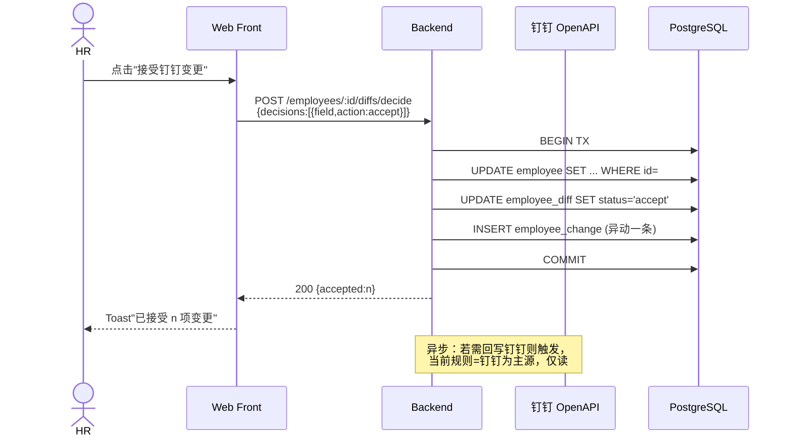
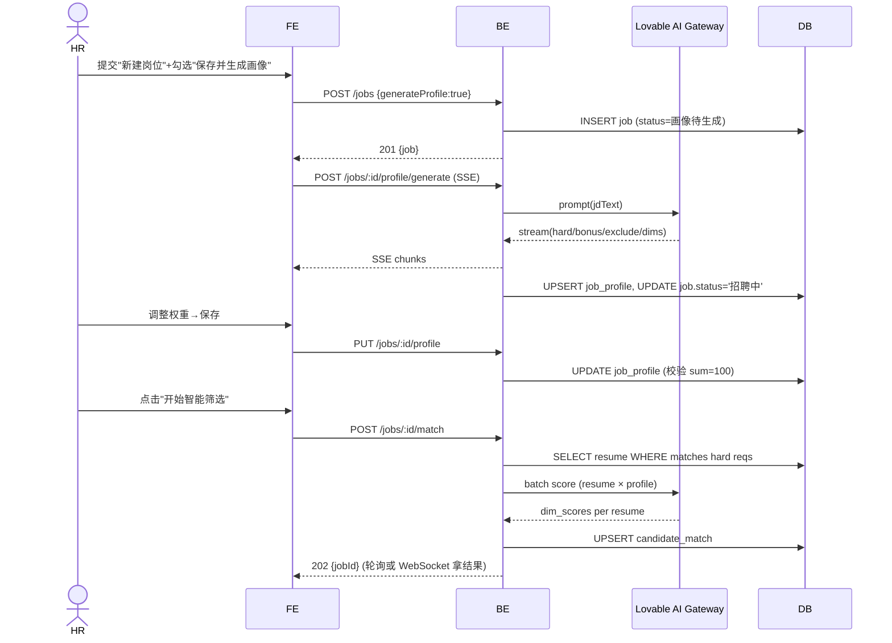
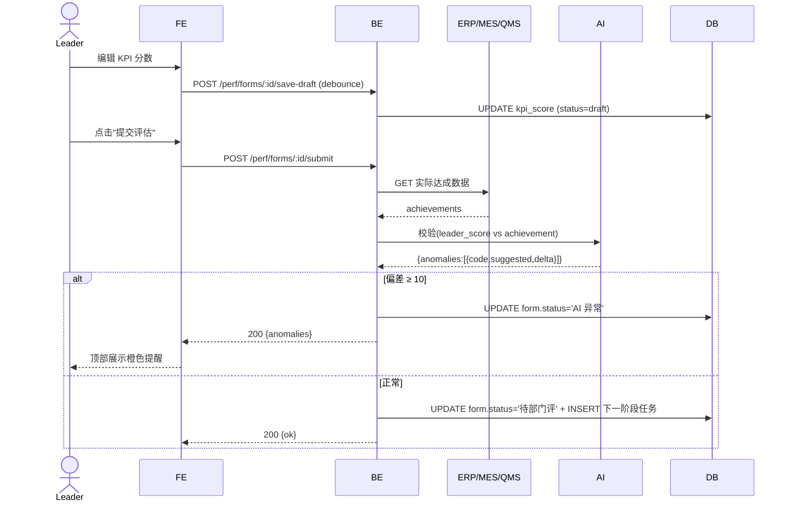
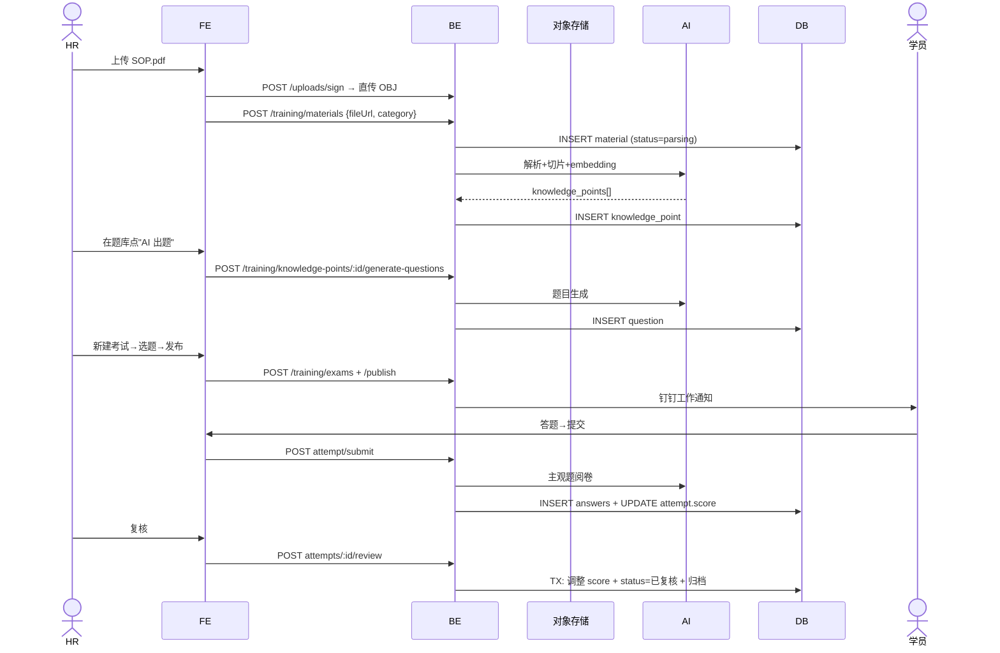
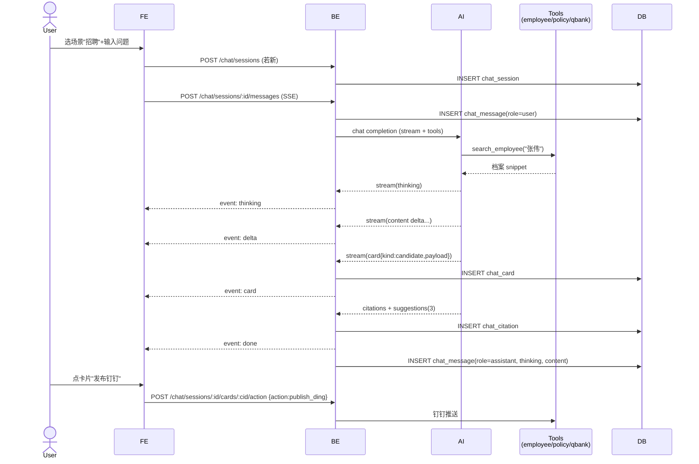

# 人事 AI 员工 · 后端 API 设计文档

> 版本：v1.0 · 2026-04-21
> 适用范围：当前前端原型（React + Vite）已实现的全部页面与交互
> 数据源：钉钉为唯一员工主数据源；MES / ERP / PLM / CRM / QMS 为绩效过程数据源

---

## 1. 文档约定与图例

每个交互在文末"5. 交互覆盖矩阵"中明确标注：

| 标记 | 含义 |
|------|------|
| 🟢 API | 需要后端接口（落库、外部调用、AI 推理） |
| 🟡 LOCAL | 纯本地状态（前端 useState / URL query） |
| ⚪ STATIC | 纯展示，数据由前端 mock 或后端通过 GET 一次性下发 |
| 🤖 AI | 需要调用 Lovable AI Gateway / 大模型（流式或同步） |
| 🔗 EXT | 需要调用外部系统（钉钉 / MES / ERP / PLM / CRM / QMS） |

约定术语：所有时间戳为 ISO 8601 UTC；金额单位为分（integer）；分页默认 `page=1&pageSize=20`；列表接口统一返回 `{ items, total, page, pageSize }`。

---

## 2. 数据模型（ER 图 + 字段表）

### 2.1 ER 图

```mermaid
erDiagram
    AUTH_USER ||--o{ USER_ROLE : has
    AUTH_USER ||--o| EMPLOYEE : "links 1:1"
    EMPLOYEE ||--o{ EMPLOYEE_DIFF : "has pending"
    EMPLOYEE ||--o{ EMPLOYEE_ATTACHMENT : owns
    EMPLOYEE ||--o{ EMPLOYEE_CHANGE : "history of"
    EMPLOYEE ||--o{ ATTENDANCE_EXCEPTION : produces
    EMPLOYEE ||--o{ OVERTIME_RECORD : produces
    EMPLOYEE ||--o{ PERFORMANCE_FORM : "evaluated in"
    EMPLOYEE ||--o{ APPRENTICE : "may be"
    EMPLOYEE ||--o{ MENTOR : "may be"
    EMPLOYEE ||--o{ EXAM_ATTEMPT : takes

    DING_SYNC_LOG }o--|| EMPLOYEE : updates

    JOB ||--|| JOB_PROFILE : "has 1"
    JOB ||--o{ CANDIDATE_MATCH : produces
    RESUME ||--o{ CANDIDATE_MATCH : "scored as"
    RESUME ||--o{ RESUME_TAG : has

    PERF_CYCLE ||--o{ PERFORMANCE_FORM : contains
    PERF_CYCLE ||--o{ STRATEGY_GOAL : aligns
    PERFORMANCE_FORM ||--o{ KPI_SCORE : has
    PERFORMANCE_FORM ||--|| INTERVIEW_REPORT : "may have"
    INDICATOR_LIBRARY ||--o{ KPI_SCORE : "referenced by"
    STRATEGY_GOAL ||--o{ DEPT_STRATEGY : breakdown
    DEPT_STRATEGY ||--o{ DEPT_KPI : contains

    TRAIN_MATERIAL ||--o{ KNOWLEDGE_POINT : "AI extracts"
    KNOWLEDGE_POINT ||--o{ QUESTION : generates
    QUESTION_BANK ||--o{ QUESTION : groups
    EXAM ||--o{ QUESTION : uses
    EXAM ||--o{ EXAM_ATTEMPT : "taken as"
    EXAM_ATTEMPT ||--o{ ANSWER : has

    MENTOR ||--o{ APPRENTICESHIP : leads
    APPRENTICE ||--o{ APPRENTICESHIP : enrolled
    APPRENTICESHIP ||--o{ TRAIN_MILESTONE : tracks

    AUTH_USER ||--o{ CHAT_SESSION : owns
    CHAT_SESSION ||--o{ CHAT_MESSAGE : contains
    CHAT_MESSAGE ||--o{ CHAT_CITATION : cites
    CHAT_MESSAGE ||--o{ CHAT_CARD : embeds
```

### 2.2 字段定义（节选关键表）

#### auth_user
| 字段 | 类型 | 约束 | 说明 |
|---|---|---|---|
| id | uuid | PK | |
| ding_user_id | text | UNIQUE, NOT NULL | 钉钉 userId |
| email | text | UNIQUE | |
| display_name | text | NOT NULL | |
| avatar_url | text | | |
| created_at | timestamptz | default now() | |

#### user_role  *(角色独立表，避免提权)*
| 字段 | 类型 | 约束 |
|---|---|---|
| id | uuid | PK |
| user_id | uuid | FK auth_user.id, ON DELETE CASCADE |
| role | enum('hr_admin','hr_specialist','dept_head','leader','employee','mentor') | NOT NULL |
| scope_dept_id | uuid | nullable，部门负责人/leader 限定范围 |
| UNIQUE(user_id, role, scope_dept_id) | | |

#### employee
| 字段 | 类型 | 约束 | 说明 |
|---|---|---|---|
| id | text | PK (E001) | |
| ding_user_id | text | UNIQUE | |
| status | enum('active','leaving','pending') | NOT NULL | |
| entity | enum(7 子公司) | NOT NULL | 合同归属 |
| department | text | NOT NULL | |
| position | text | | |
| hire_date | date | | |
| contract_type | text | | |
| contract_start | date | | |
| contract_end | date | | |
| id_number | text | encrypted | 加密存储 |
| id_end | date | | |
| phone | text | | |
| completeness | int | 0-100 | 计算字段（trigger） |
| sync_status | enum('synced','pending','diff','failed') | | |
| last_sync_at | timestamptz | | |
| ... | | | 详见 EmployeeDetail 全部字段 |

#### employee_diff  *(钉钉差异待决议)*
| 字段 | 类型 |
|---|---|
| id, employee_id, field, dingtalk_value, system_value, decided_at, decided_by, decision enum('accept','reject','pending') |

#### attendance_exception
| 字段 | 类型 |
|---|---|
| id, employee_id, date, type enum('迟到','早退','缺卡','旷工'), scheduled_in, scheduled_out, actual_in, actual_out, location, ai_summary, ai_suggestion, ai_confidence, status enum('pending','waiting-employee','approving','done'), note, handled_by, handled_at |

#### overtime_record
| 字段 | 类型 |
|---|---|
| id, employee_id, date, dept_kind enum('职能部门','生产一线'), clock_in, clock_out, abnormal_kind, work_hours, subsidy_type enum('餐补','调休','金额','—'), subsidy_value, status enum('pending','approved','rejected') |

#### job
| 字段 | 类型 |
|---|---|
| id, title, dept, location, headcount, salary_range, urgency enum('高','中','低'), status enum('招聘中','画像待生成','已暂停','已完成'), owner_id, created_at, jd_text |

#### job_profile
| 字段 | 类型 |
|---|---|
| job_id PK FK, hard_reqs jsonb[], bonus jsonb[], excludes jsonb[], dimensions jsonb (key/label/weight/desc), ai_summary text, generated_at |

#### resume
| 字段 | 类型 |
|---|---|
| id, name, gender, age, education, school, years, current_title, current_company, city, expect_salary, source enum, file_url, file_name, parse_status enum('已解析','解析中','解析失败'), highlights text[], skills text[], uploaded_at |

#### candidate_match
| 字段 | 类型 |
|---|---|
| id, job_id, resume_id, match_score, level enum('强匹配','可考虑','弱匹配'), dim_scores jsonb, pros text[], cons text[], ai_summary, status enum('待评估','已加入面试','已 pass'), rank int |
| UNIQUE(job_id, resume_id) | |

#### perf_cycle
| id, code (2025Q2), name, start_date, end_date, template_id, scope_dept_ids[], status enum('进行中','已结案'), coef numeric |

#### performance_form
| id, cycle_id, employee_id, self_score numeric, leader_score numeric, dept_score numeric, total numeric, level text, status enum('已提交','待上级评','待部门评','超期','AI 异常'), anomaly_reason text, comment text |

#### kpi_score
| id, form_id, indicator_code, weight int, target text, achievement text, source text, self_score int, leader_score int, ai_suggested int |

#### indicator_library
| code PK, name, family (部门), unit, target, source, ai_tag |

#### strategy_goal / dept_strategy / dept_kpi
| 公司目标分解三层（period, kpi, target, weight） |

#### train_material
| id, file_url, mime, uploaded_by, parse_status, summary, kp_count |

#### knowledge_point
| id, material_id, category enum('laser','solar','qa','trade','other'), title, content, embedding vector(1536) |

#### question / question_bank / exam
| 题库与试卷；question(category, type enum('single','multi','judge','qa'), difficulty, content, options jsonb, answer_key, kp_id) |
| exam(id, title, scope_dept, scope_employee_ids[], question_ids[], duration_min, status enum('草稿','发布中','进行中','已结束','归档'), avg_score, created_by) |

#### exam_attempt / answer
| attempt(id, exam_id, employee_id, started_at, submitted_at, score, ai_score, hr_review_status enum('待复核','已复核'), reviewer_id) |
| answer(id, attempt_id, question_id, content, score, ai_feedback) |

#### mentor / apprentice / apprenticeship / train_milestone
| mentor(employee_id PK, level enum('金牌','资深','认证'), years, active, capacity, graduated, rating, pass_rate, site, crafts[], tags[], status enum('available','full','rest')) |
| apprenticeship(id, mentor_id, apprentice_id, site, plan_template, start_date, end_date, status) |
| train_milestone(id, apprenticeship_id, week, name, due_date, state enum('done','active','pending'), evidence, score) |

#### chat_session / chat_message / chat_card / chat_citation
| session(id, user_id, scene enum('recruit','perf','train','attendance','employee','data'), title, pinned bool, starred bool, last_message_at, archived_at) |
| message(id, session_id, role enum('user','assistant','tool'), content, thinking text, created_at, parent_id) |
| card(id, message_id, kind enum('candidate','exam_draft','attendance','policy'), payload jsonb, actions jsonb) |
| citation(id, message_id, source_type enum('employee','policy','question_bank','knowledge_point'), source_id, snippet) |

#### ding_sync_log
| id, sync_type enum('full','incremental','employee'), started_at, finished_at, status, diff_count, error |

---

## 3. API 接口清单

> 全部接口以 `/api/v1` 为前缀。鉴权见 §4.1。
> 错误码统一：`400` 参数错；`401` 未登录；`403` 越权；`404` 不存在；`409` 状态冲突 / 幂等冲突；`422` 业务校验失败；`429` 限流；`500` 服务器错；`503` 外部依赖不可用。

### 3.1 鉴权 / 用户

| Method | Path | 入参 | 出参 | 权限 | 业务规则 |
|---|---|---|---|---|---|
| POST | /auth/dingtalk/callback | `{ code }` | `{ token, user, roles }` | 公开 | 钉钉扫码登录；首次登录创建 auth_user + 触发首次档案同步 |
| POST | /auth/refresh | `{ refresh_token }` | `{ token }` | 已登录 | 滑动刷新，30 天空闲过期 |
| POST | /auth/logout | — | 204 | 已登录 | |
| GET | /me | — | `{ user, roles, perms }` | 已登录 | 含权限位用于前端守卫 |

### 3.2 工作台 Dashboard

| Method | Path | 入参 | 出参 | 权限 | 业务规则 |
|---|---|---|---|---|---|
| GET | /dashboard/stats | — | `{ pendingException, openJobs, monthlyHires, perfRate }` | 已登录 | 4 张统计卡，按当前用户数据范围计算 |
| GET | /dashboard/todos | — | `Todo[]` | 已登录 | 今日待办：跨模块聚合，最多 10 条 |
| GET | /dashboard/insight | — | `{ text, generatedAt }` | 已登录 🤖 | AI 每日洞察，1 小时缓存 |

### 3.3 员工档案助手

#### 列表与筛选
| Method | Path | 入参 | 出参 | 权限 | 业务规则 |
|---|---|---|---|---|---|
| GET | /employees | `q, department, entity, contractStatus, statFilter('contract'\|'id'\|'missing'\|'sync'), page, pageSize, sortBy` | `{ items: EmployeeRow[], total, ... }` | hr_specialist+ | 全部筛选/搜索/排序均后端处理 |
| POST | /employees/sync | `{ scope:'all'\|'incremental'\|'ids', ids?:string[] }` | `{ jobId }` 202 | hr_admin | 异步从钉钉拉取，写 ding_sync_log；🔗 EXT |
| GET | /employees/sync/status | `?jobId=` | `{ status, total, processed, diffCount }` | hr_specialist+ | 轮询 |
| POST | /employees/export | 同列表筛选 | `{ downloadUrl }` | hr_specialist+ | 导出 xlsx，5 分钟有效签名 |
| POST | /employees/bulk-sync | `{ ids[] }` | `{ updated }` | hr_admin | 批量"重新同步" |
| POST | /employees/bulk-accept-diff | `{ ids[] }` | `{ accepted }` | hr_admin | 批量接受钉钉差异 |
| POST | /employees/bulk-remind | `{ ids[], message? }` | `{ sent }` | hr_specialist+ | 通过钉钉机器人提醒补资料；幂等 key=`remind:{ids hash}:{date}` |

#### 详情、差异、附件
| Method | Path | 入参 | 出参 | 权限 | 业务规则 |
|---|---|---|---|---|---|
| GET | /employees/:id | — | `EmployeeDetail` (8 个 tab 的字段全集) | 自己 / leader 可看自己下属 / hr | RLS 行级安全 |
| POST | /employees/:id/sync | — | `{ diffs }` | hr | 立即从钉钉拉单条 |
| GET | /employees/:id/diffs | — | `EmployeeDiff[]` | hr | |
| POST | /employees/:id/diffs/decide | `{ decisions: { field, action:'accept'\|'reject' }[] }` | `{ accepted, rejected }` | hr_admin | 写入 employee + 写 employee_change |
| GET | /employees/:id/changes | `?type, page` | `Change[]` | hr / 自己 | 异动历史 |
| GET | /employees/:id/sync-history | — | `DingSyncLog[]` | hr | |
| POST | /employees/:id/attachments | multipart `file, name, kind` | `Attachment` | hr / 本人 | 仅 PDF/JPG/PNG/DOCX，10 MB；🤖 触发 OCR/识别 |
| DELETE | /employees/:id/attachments/:aid | — | 204 | hr_admin | |
| POST | /employees/:id/notify-ding | `{ template, payload }` | `{ msgId }` | hr | 🔗 EXT 钉钉工作通知；幂等 |
| GET | /employees/:id/files-status | — | `{ items:[{kind,ok}] }` | hr / 本人 | 资料附件清单（5 类） |

#### 异动 / 到期提醒（员工列表 Tab）
| Method | Path | 出参 | 权限 |
|---|---|---|---|
| GET | /employees/changes | `Change[]` | hr |
| GET | /employees/expiring | `?type='contract'\|'id'&days=30` | `Employee[]` | hr |

### 3.4 考勤助手

| Method | Path | 入参 | 出参 | 权限 | 业务规则 |
|---|---|---|---|---|---|
| GET | /attendance/exceptions | `dateRange, type, status, group, page` | 列表 | hr / leader (本部门) | 所有筛选后端处理 |
| GET | /attendance/exceptions/:id | — | `ExceptionDetail`（含 leaveRecords / punchRecords） | 同上 | |
| POST | /attendance/exceptions/:id/adopt-ai | `{ note? }` | 更新 | hr / leader | 采纳 AI 建议→写处理日志，状态→done |
| POST | /attendance/exceptions/:id/mark-done | `{ note? }` | 更新 | hr / leader | 手工标记 |
| POST | /attendance/exceptions/:id/contact | — | `{ msgId }` | hr | 钉钉发起会话；🔗 EXT |
| POST | /attendance/exceptions/sync | — | `{ jobId }` | hr_admin | 🔗 从打卡机/钉钉拉当日异常并跑 AI 规则 |
| POST | /attendance/exceptions/:id/ai-recheck | — | `{ summary, suggestion, confidence }` | hr 🤖 | 重新跑 AI |
| GET | /attendance/exceptions/:id/related | — | `{ leaves[], punches[] }` | 同上 | "关联记录" Sheet |

| Method | Path | 入参 | 出参 | 权限 |
|---|---|---|---|---|
| GET | /attendance/overtime | `dateRange, dept, status, page` | 列表 | hr / leader |
| POST | /attendance/overtime/:id/approve | `{ subsidyOverride? }` | 更新→approved | hr |
| POST | /attendance/overtime/:id/reject | `{ reason }` | 更新→rejected | hr |
| POST | /attendance/overtime/upload | multipart `file` | `{ jobId }` | hr_admin | 🤖 解析 CSV/PDF 加班数据 |
| GET | /attendance/overtime/upload/status | `?jobId` | `{ status, parsed, errors }` | hr_admin | |

### 3.5 招聘助手

#### 岗位需求池
| Method | Path | 入参 | 出参 | 权限 | 业务规则 |
|---|---|---|---|---|---|
| GET | /jobs | `status, dept, q, page` | 列表 + `stats{total,active,pending,resumes}` | hr / dept_head | |
| POST | /jobs | `{ title, dept, location, headcount, salary, urgency, owner, jd, generateProfile:bool }` | `Job` | hr | `generateProfile=true` → 异步触发 AI 生成 job_profile |
| GET | /jobs/:id | — | `Job` | hr / owner | |
| PATCH | /jobs/:id | 部分字段 | `Job` | hr / owner | |
| POST | /jobs/:id/pause | — | `Job` | hr | 状态→已暂停 |
| POST | /jobs/:id/close | — | `Job` | hr | 状态→已完成 |

#### 岗位画像
| Method | Path | 入参 | 出参 | 权限 |
|---|---|---|---|---|
| GET | /jobs/:id/profile | — | `JobProfile` | hr / owner |
| POST | /jobs/:id/profile/generate | `{ jdText }` | `{ profile }` 🤖 流式 SSE | hr | AI 抽取硬性/加分/排除/权重 |
| PUT | /jobs/:id/profile | `JobProfile` | `JobProfile` | hr | 总权重必须 = 100，否则 422 |
| POST | /jobs/:id/profile/save-draft | 同上 | 204 | hr | |

#### 候选人匹配
| Method | Path | 入参 | 出参 | 权限 |
|---|---|---|---|---|
| POST | /jobs/:id/match | `{ force?:bool }` | `{ jobId }` 异步 🤖 | hr | 重新跑匹配 |
| GET | /jobs/:id/candidates | `level, q, sortBy('score'\|'exp'), page` | `CandidateMatch[]` + `stats` | hr / owner | |
| GET | /jobs/:id/candidates/:cid | — | `CandidateDetail`（含 dim_scores、pros/cons） | hr |
| POST | /jobs/:id/candidates/:cid/interview | — | 状态→已加入面试 | hr |
| POST | /jobs/:id/candidates/:cid/pass | `{ reason? }` | 状态→已 pass | hr |
| POST | /jobs/:id/candidates/bulk-interview | `{ candidateIds[] }` | `{ added }` | hr |
| POST | /jobs/:id/candidates/:cid/contact | `{ channel:'phone'\|'email'\|'ding' }` | `{ msgId }` | hr |

#### 简历库
| Method | Path | 入参 | 出参 | 权限 |
|---|---|---|---|---|
| GET | /resumes | `q, education, years, city, source, page` | 列表 + `stats` | hr |
| POST | /resumes/upload | multipart `files[], source` | `{ resumeIds[] }` | hr | 异步解析 🤖；最多 50 份/次 |
| GET | /resumes/:id | — | `Resume` | hr |
| POST | /resumes/bulk-tag | `{ ids[], tags[] }` | `{ tagged }` | hr |
| POST | /resumes/bulk-export | `{ ids[] }` | `{ downloadUrl }` | hr |
| POST | /resumes/bulk-match | `{ resumeIds[], jobId }` | `{ matches[] }` | hr |
| DELETE | /resumes/:id | — | 204 | hr_admin |

### 3.6 绩效助手

#### 周期 & 名单
| Method | Path | 入参 | 出参 | 权限 |
|---|---|---|---|---|
| GET | /perf/overview | — | `{ stats, stages[], history[] }` | hr / dept_head |
| GET | /perf/cycles | `?status` | `Cycle[]` | hr |
| POST | /perf/cycles | `NewCyclePayload`（见 NewCycleDialog） | `Cycle` | hr_admin |
| GET | /perf/cycles/:id | — | `Cycle + stages[]` | hr / 范围内 |
| POST | /perf/cycles/:id/remind | `{ scope:'all'\|'overdue'\|'stage', stageKey? }` | `{ sent }` | hr | 一键催办；幂等 5 分钟 |
| GET | /perf/cycles/:id/forms | `tab('all'\|'anomaly'\|'overdue'), dept, q, page` | `Form[]` | hr / dept_head |
| GET | /perf/cycles/:id/export | — | xlsx | hr |
| GET | /perf/forms/:id | — | `FormDetail`（含 KPI 表 + AI 校验） | hr / 上级 / 本人 |
| PATCH | /perf/forms/:id | `{ kpis:[{code, selfScore?, leaderScore?}], comment? }` | `Form` | 自评 → 本人；上级评 → 直属上级 |
| POST | /perf/forms/:id/submit | — | `Form` | 状态机推进；触发 AI 校验 🤖 |
| POST | /perf/forms/:id/save-draft | 同 PATCH | 204 | |
| POST | /perf/forms/:id/adopt-ai | — | `Form` | leader | 一键采纳 AI 推荐分 |
| POST | /perf/forms/:id/ai-comment | — | `{ text }` 🤖 流式 | leader | 生成评语 |

#### 战略目标分解
| Method | Path | 入参 | 出参 | 权限 |
|---|---|---|---|---|
| GET | /perf/strategy/:period | — | `{ company, depts[] }` | hr / dept_head |
| PUT | /perf/strategy/:period/company | `{ items:KpiItem[] }` | 200 | hr_admin | 权重和必须 = 100，否则 422 |
| PUT | /perf/strategy/:period/dept/:deptId | `{ kpis:KpiItem[] }` | 200 | hr_admin / 部门负责人 | 权重和 = 100 |
| POST | /perf/strategy/:period/ai-breakdown | `{ deptIds?[] }` | `{ depts[] }` 🤖 流式 | hr | 基于公司目标 AI 拆解部门 KPI |

#### 指标库
| Method | Path | 入参 | 出参 | 权限 |
|---|---|---|---|---|
| GET | /perf/indicators | `family, q, page` | `Indicator[]` + `families[]` | hr |
| POST | /perf/indicators | `NewIndicatorPayload` | `Indicator` | hr_admin |
| PATCH | /perf/indicators/:code | 部分字段 | `Indicator` | hr_admin |
| DELETE | /perf/indicators/:code | — | 204 | hr_admin |
| POST | /perf/indicators/ai-refresh | — | `{ updated }` 🤖 | hr | 行业基准更新 |

#### 过程数据
| Method | Path | 出参 | 权限 |
|---|---|---|---|
| GET | /perf/datasources | `DataSource[]` (status, lastSync, indicators) | hr |
| POST | /perf/datasources/:name/connect | `{ config }` | 200 🔗 | hr_admin |
| POST | /perf/datasources/:name/sync | — | `{ jobId }` | hr_admin |
| GET | /perf/progress | `?cycleId` | `ProgressRow[]` | hr / dept_head |

#### 面谈辅助
| Method | Path | 入参 | 出参 | 权限 |
|---|---|---|---|---|
| GET | /perf/interviews | `?cycleId, status` | `Interview[]` | hr / leader |
| GET | /perf/interviews/:id | — | `InterviewReport`（话术、下季度目标） | leader / 本人之上级 |
| POST | /perf/interviews/:id/regenerate | — | `InterviewReport` 🤖 流式 | leader |
| POST | /perf/interviews/:id/complete | `{ notes?, goalsNext?[] }` | 200 | leader | 标记面谈完成并归档 |

### 3.7 培训助手

#### 概览 / 中心
| Method | Path | 出参 | 权限 |
|---|---|---|---|
| GET | /training/overview | `{ kpis[4], tasks[], examsRecent[], timeline[], kbStats[] }` | hr / mentor |

#### 试卷与考试
| Method | Path | 入参 | 出参 | 权限 |
|---|---|---|---|---|
| POST | /training/exams | `NewExamPayload`（题目数、难度、范围、时长） | `Exam` 🤖 异步生成题目 | hr |
| GET | /training/exams | `q, status, dept, page` | 列表 | hr |
| GET | /training/exams/:id | — | `Exam + questions[]` | hr |
| POST | /training/exams/:id/publish | `{ targetEmployeeIds[], notify:bool }` | 200 | hr | 钉钉推送 |
| POST | /training/exams/:id/archive | — | 200 | hr |
| POST | /training/exams/:id/regenerate-questions | `{ partial?:bool }` | `Exam` 🤖 | hr |
| GET | /training/exams/:id/attempts | — | `Attempt[]` | hr |
| GET | /training/attempts/:id | — | `Attempt + answers[]` | hr / 本人 |
| POST | /training/attempts/:id/ai-grade | — | `{ score, feedback }` 🤖 | hr | 主观题 AI 初评 |
| POST | /training/attempts/:id/review | `{ scores: { answerId: score }[], finalScore }` | 200 | hr | HR 复核 |

#### 培训材料 / 知识沉淀
| Method | Path | 入参 | 出参 | 权限 |
|---|---|---|---|---|
| POST | /training/materials | multipart `files[], category` | `{ materialIds[] }` | hr | 异步解析 🤖 |
| GET | /training/materials | `q, status, page` | `Material[]` | hr |
| GET | /training/materials/:id | — | `Material + knowledgePoints[]` | hr |
| POST | /training/materials/:id/reparse | — | 200 🤖 | hr |
| GET | /training/knowledge-points | `category, q, page` | `KP[]` | hr / mentor |
| POST | /training/knowledge-points/:id/generate-questions | `{ types[], n }` | `Question[]` 🤖 | hr |

#### 题库
| Method | Path | 入参 | 出参 | 权限 |
|---|---|---|---|---|
| GET | /training/questions | `category, type, difficulty, q, page` | `Question[]` | hr |
| POST | /training/questions | `NewQuestion` | `Question` | hr |
| PATCH | /training/questions/:id | 部分 | `Question` | hr |
| DELETE | /training/questions/:id | — | 204 | hr |
| POST | /training/questions/bulk-import | multipart | `{ added }` | hr |

#### 在岗培训 / 学徒
| Method | Path | 出参 | 权限 |
|---|---|---|---|
| GET | /training/onsite | `?site, status` | 学徒列表 + 节点 | hr / mentor |
| GET | /training/onsite/:id | `Apprenticeship + milestones[]` | 同上 |
| POST | /training/onsite/:id/milestones/:mid/submit | `{ evidence, score, comment }` | 200 | mentor |
| POST | /training/onsite/:id/final-exam | — | `{ examId }` | hr | 触发出师考核 |

#### 导师
| Method | Path | 入参 | 出参 | 权限 |
|---|---|---|---|---|
| GET | /training/mentors | `q, site, craft, level, status` | `Mentor[]` | hr / dept_head |
| POST | /training/mentors | `NewMentorPayload` | `Mentor` | hr_admin |
| GET | /training/mentors/:id | — | `MentorDetail`（评分、徒弟、专长） | hr / 本人 |
| POST | /training/mentors/:id/assign | `{ apprenticeId, plan }` | `Apprenticeship` | hr | 校验 capacity > active |
| POST | /training/mentors/:id/contact | — | `{ msgId }` | hr / dept_head |
| POST | /training/mentors/:id/rest | `{ until }` | 状态→rest | hr |

### 3.8 对话（新建 / 历史）

| Method | Path | 入参 | 出参 | 权限 | 业务规则 |
|---|---|---|---|---|---|
| GET | /chat/scenes | — | `Scene[6]`（招聘/绩效/培训/考勤/员工/数据，含预设 Prompt） | 已登录 | ⚪ 可前端硬编码或配置中心下发 |
| POST | /chat/sessions | `{ scene, title? }` | `Session` | 已登录 | |
| GET | /chat/sessions | `q, scene, filter('pinned'\|'starred'\|'all'), group('time'), page` | `{ items, groups }` | 已登录 | 时间分组（今日/昨日/本周/更早）后端聚合 |
| GET | /chat/sessions/:id | — | `Session + messages[]` | 所有者 | |
| PATCH | /chat/sessions/:id | `{ title?, pinned?, starred? }` | `Session` | 所有者 | 重命名 / 置顶 / 收藏 |
| DELETE | /chat/sessions/:id | — | 204 | 所有者 | 软删 |
| POST | /chat/sessions/:id/messages | `{ content, attachments? }` | `EventStream`（SSE）🤖 | 所有者 | 流式：先发 thinking，再 content，再 cards/citations/suggestions |
| POST | /chat/sessions/:id/regenerate | `{ messageId }` | SSE 🤖 | 所有者 | |
| POST | /chat/sessions/:id/feedback | `{ messageId, kind:'up'\|'down', reason? }` | 204 | 所有者 | |
| POST | /chat/sessions/:id/export | `{ format:'md'\|'pdf' }` | `{ downloadUrl }` | 所有者 | |
| POST | /chat/sessions/:id/cards/:cardId/action | `{ action, payload? }` | `{ result }` | 所有者 | 卡片"查看详情/发布钉钉"等行动 |

### 3.9 通用 / 文件 / Webhook

| Method | Path | 用途 |
|---|---|---|
| POST | /uploads/sign | 取签名 URL 直传对象存储 |
| POST | /webhooks/dingtalk | 钉钉事件回调（员工变更、消息） |
| POST | /webhooks/mes | MES 推送 OEE 等指标 |
| GET | /jobs/:jobId/status | 通用异步任务状态轮询 |

---

## 4. 非功能需求

### 4.1 鉴权与权限
- **登录**：钉钉扫码 OAuth → 后端发放 `access_token`（JWT，30 min）+ `refresh_token`（30 day，rotation）。Token 放 httpOnly Cookie + `Authorization: Bearer` 双通道。
- **角色**：`user_role` 独立表，使用 SECURITY DEFINER 函数 `has_role(user_id, role)` 判定，避免 RLS 递归与提权。
- **数据范围**：
  - `hr_admin / hr_specialist`：全员
  - `dept_head`：本部门 + 下级部门
  - `leader`：直接下属
  - `employee`：仅自己
  - `mentor`：仅自己带教的学徒
- **RLS**：所有员工/绩效/考勤/培训表均启用行级安全。

### 4.2 分页规则
- 列表统一 `?page=1&pageSize=20`，最大 100。
- 返回 `{ items, total, page, pageSize, hasMore }`。
- 复杂查询（候选人匹配、知识点搜索）支持 `cursor` 游标分页。

### 4.3 排序与筛选
- 排序：`?sortBy=field&order=asc|desc`，仅允许白名单字段。
- 筛选：所有页面的 Tabs / Select / Search 都通过 query string 传给同一接口，前端不做客户端过滤（当前 mock 是客户端过滤，上线必须切到服务端）。

### 4.4 幂等性
- **写操作幂等 key**：客户端必须传 `Idempotency-Key`（uuid v4），服务端 24h 去重，命中返回首次结果。
- **必须幂等的接口**：
  - 一切"催办 / 提醒 / 推送钉钉"接口（防重复打扰）
  - 文件上传（按 sha256 + uploader 去重）
  - 状态推进（mark-done / approve / submit），重复请求返回 200 但不再变更
  - 创建型接口（POST /jobs、/perf/cycles、/training/exams 等）

### 4.5 事务边界
| 业务 | 事务范围 |
|---|---|
| 接受钉钉差异 | `employee` 字段更新 + `employee_diff.status='accept'` + `employee_change` 一条历史记录 |
| 提交评估表 | `performance_form.status` 推进 + `kpi_score` 全部 upsert + 触发下一阶段任务 |
| 出师 | `apprenticeship.status='done'` + `mentor.graduated++` + `apprentice.status='active'` + 发证 |
| AI 阅卷复核 | `answer.score` 批量更新 + `exam_attempt.score` 重算 + `hr_review_status='已复核'` |
| 创建岗位 + 生成画像 | `job` insert，画像生成异步任务（不在同事务） |
| 钉钉同步 | 单条 employee 更新原子；批量分批事务（每 100 条一提交） |

跨外部系统的写操作不做长事务，使用 **Saga + 补偿**（如钉钉推送失败 → 标记 `notify_status='failed'` 并重试 3 次）。

### 4.6 限流
- 用户级：60 req/min；写操作 30 req/min。
- AI 接口：单用户 10 req/min，全局 200 req/min（保护 token 配额）。
- 钉钉同步：全量 1 次/小时；增量 1 次/分钟。

### 4.7 缓存
- Dashboard stats：60s。
- Dashboard insight (AI)：1h，按用户。
- 指标库 / 场景模板 / 角色权限：CDN 边缘缓存 + ETag。

### 4.8 审计与日志
- 所有写操作落 `audit_log(actor, action, target, before, after, ip, ua, ts)`。
- 钉钉同步、AI 调用单独有 `ding_sync_log` / `ai_call_log`（含 token 用量、耗时、scene）。

### 4.9 安全
- 身份证号、银行卡：列加密（pgcrypto），日志脱敏。
- 文件存储：私有桶 + 短期签名 URL（5 min）。
- 防越权：所有 :id 路径强制走 RLS + 业务层二次校验。
- AI Prompt 注入防护：用户输入与系统 Prompt 隔离 + 禁止工具调用执行任意 SQL。

---

## 5. 关键业务流程（时序图）

### 5.1 钉钉差异决议（员工档案）

### 5.2 招聘：从创建岗位 → 生成画像 → 候选人匹配

### 5.3 绩效评估表提交 + AI 校验

### 5.4 培训：上传材料 → 知识点 → 出题 → 考试 → 阅卷

### 5.5 新建对话（流式 + 卡片 + 引用 + 追问）

---

## 6. 交互覆盖矩阵（每页所有交互不漏）

> 标记说明见 §1。

### 6.1 工作台 `/`
| 交互 | 标记 | 接口 |
|---|---|---|
| 4 张统计卡渲染 | 🟢 API | GET /dashboard/stats |
| 模块入口卡片跳转 | 🟡 LOCAL | 路由跳转 |
| 今日待办列表渲染与跳转 | 🟢 API | GET /dashboard/todos |
| AI 今日洞察 | 🤖 API | GET /dashboard/insight |

### 6.2 员工档案 `/employees`
| 交互 | 标记 | 接口 |
|---|---|---|
| Tabs（员工列表/异动记录/到期提醒） | 🟡 LOCAL + 🟢 API | 切 tab 触发不同 GET |
| 同步状态横幅"上次全量同步" | 🟢 API | 含在 GET /employees 头部 |
| "立即同步"/"从钉钉同步" | 🟢 + 🔗 EXT | POST /employees/sync |
| "查看待核对"快捷过滤 | 🟡 LOCAL | 设置 statFilter→重发 GET |
| 4 张统计卡（待同步/合同/身份证/资料缺失）& 点击过滤 | 🟢 + 🟡 | 统计字段后端，filter URL query |
| 搜索框（姓名/手机号/部门/职务） | 🟢 API | GET /employees?q= |
| 合同归属/部门/合同状态下拉 | 🟢 API | GET /employees?... |
| 重置按钮 | 🟡 LOCAL | 清 query |
| 全选/单选 checkbox | 🟡 LOCAL | |
| 批量"重新同步" | 🟢 + 🔗 | POST /employees/bulk-sync |
| 批量"接受钉钉变更" | 🟢 | POST /employees/bulk-accept-diff |
| 批量"提醒补资料" | 🟢 + 🔗 | POST /employees/bulk-remind |
| 导出 | 🟢 API | POST /employees/export |
| 行内"差异" Sheet | 🟢 API | GET /employees/:id/diffs |
| 行内菜单"补录附件" | 🟢 API | POST /employees/:id/attachments |
| UpdateMaterialsDialog 决议 accept/reject | 🟢 API | POST /employees/:id/diffs/decide |

### 6.3 员工详情 `/employees/:id`
| 交互 | 标记 | 接口 |
|---|---|---|
| 顶部"差异"提示与"仅看差异"切换 | 🟢 + 🟡 | GET /employees/:id 已含 diff，过滤本地 |
| "从钉钉同步"按钮 | 🟢 + 🔗 | POST /employees/:id/sync |
| "钉钉提醒"按钮 | 🟢 + 🔗 | POST /employees/:id/notify-ding |
| 8 个 Tab（组织/合同/基础/教育/联系/离职/附件/异动） | ⚪ STATIC | 全部由 GET /employees/:id 一次返回 |
| 字段来源/差异 tooltip | ⚪ STATIC | 字段元数据随响应 |
| "补录附件"上传 | 🟢 + 🤖 | POST /employees/:id/attachments |
| 异动历史 / 同步记录 | 🟢 API | GET /employees/:id/changes & sync-history |

### 6.4 考勤 `/attendance`
| 交互 | 标记 | 接口 |
|---|---|---|
| Tab "考勤 / 加班" | 🟡 LOCAL | |
| **考勤 Tab：** 日期范围筛选 | 🟢 API | GET /attendance/exceptions?dateRange |
| 类型筛选（迟到/早退/缺卡/旷工） | 🟢 API | 同上 |
| 状态筛选 | 🟢 API | 同上 |
| 行内"标记已处理" | 🟢 API | POST /attendance/exceptions/:id/mark-done |
| 行内"联系员工" | 🟢 + 🔗 | POST /attendance/exceptions/:id/contact |
| "查看详情"跳转 | 🟡 LOCAL | |
| "共 N 条记录"统计 | ⚪ 含在响应 | |
| **加班 Tab：** 部门/状态/日期筛选 | 🟢 API | GET /attendance/overtime |
| "上传补贴/调休数据" | 🟢 + 🤖 | POST /attendance/overtime/upload |
| 审批通过/驳回 | 🟢 API | POST /attendance/overtime/:id/approve\|reject |
| 联系员工 | 🟢 + 🔗 | |

### 6.5 考勤异常详情 `/attendance/exception/:id`
| 交互 | 标记 | 接口 |
|---|---|---|
| 整页数据加载 | 🟢 API | GET /attendance/exceptions/:id |
| "关联记录" Sheet | ⚪ 含在详情响应 | |
| 处理备注输入 | 🟡 LOCAL | |
| "采纳 AI 建议" | 🟢 API | POST /attendance/exceptions/:id/adopt-ai |
| "标记已处理" | 🟢 API | POST .../mark-done |
| "联系员工" | 🟢 + 🔗 | POST .../contact |

### 6.6 招聘助手 `/recruiting`
| 交互 | 标记 | 接口 |
|---|---|---|
| Tab "招聘需求池 / 简历库"（URL query 同步） | 🟡 LOCAL | |
| 4 张统计卡 | 🟢 API | GET /jobs (含 stats) |
| 状态 Tabs（全部/招聘中/画像待生成/已暂停） | 🟢 API | GET /jobs?status= |
| 部门下拉、关键词搜索 | 🟢 API | GET /jobs?dept=&q= |
| 岗位卡片渲染 | 🟢 API | 同上 |
| "新建岗位需求"对话框提交 | 🟢 + 🤖 | POST /jobs (generateProfile?) |
| 跳转岗位画像 / 候选人 | 🟡 LOCAL | |
| **简历库子页**：搜索、学历/年限/城市/来源筛选 | 🟢 API | GET /resumes |
| "上传简历"抽屉 | 🟢 + 🤖 | POST /resumes/upload |
| 全选 / 单选 / 已选打标签 / 匹配到岗位 / 批量导出 | 🟢 API | bulk-* 接口 |
| 行"查看详情" Sheet | 🟢 API | GET /resumes/:id |
| 解析中状态轮询 | 🟢 API | GET /resumes/:id 状态字段 |

### 6.7 岗位画像 `/recruiting/job/:id`
| 交互 | 标记 | 接口 |
|---|---|---|
| 加载画像 | 🟢 API | GET /jobs/:id/profile |
| 编辑岗位基本信息（标题/部门/地点/HC/薪资） | 🟢 API | PATCH /jobs/:id |
| JD Textarea 编辑 | 🟡 LOCAL | |
| "AI 重新生成画像" / 首次"AI 生成" | 🤖 SSE | POST /jobs/:id/profile/generate |
| 三组规则（硬性/加分/排除）增/改/删 | 🟡 LOCAL（保存时统一 PUT） | |
| 维度权重 Slider（5 维） | 🟡 LOCAL | |
| 总权重校验（=100） | 🟡 LOCAL + 🟢 422 | |
| "保存草稿" | 🟢 API | POST .../save-draft |
| "开始智能筛选" | 🟢 API | POST /jobs/:id/match → 跳转 |
| 预估匹配统计 | 🟢 API | 包含在 GET profile |

### 6.8 候选人推荐 `/recruiting/job/:id/candidates`
| 交互 | 标记 | 接口 |
|---|---|---|
| AI 匹配总结 / 4 统计卡 | 🟢 API | GET /jobs/:id/candidates (含 stats) |
| Tabs（全部/强匹配/可考虑/弱匹配） | 🟢 API | ?level= |
| 关键词搜索（姓名/公司） | 🟢 API | ?q= |
| 排序（匹配度/工作年限） | 🟢 API | ?sortBy= |
| 卡片选中 checkbox | 🟡 LOCAL | |
| "重新匹配" | 🟢 API | POST /jobs/:id/match |
| "批量加入面试" | 🟢 API | POST .../bulk-interview |
| 候选人详情 Sheet | 🟢 API | GET /jobs/:id/candidates/:cid |
| 详情中"加入面试 / Pass / 联系" | 🟢 API | POST .../interview \| pass \| contact |

### 6.9 绩效助手 `/performance`
| 交互 | 标记 | 接口 |
|---|---|---|
| 4 张顶部指标 | 🟢 API | GET /perf/overview |
| 5 个 Tab（考核周期/战略/指标库/过程数据/面谈辅助） | 🟡 LOCAL | |
| "一键催办" / "新建考核周期" | 🟢 / 🟢 | POST /perf/cycles/:id/remind ; POST /perf/cycles |
| **考核周期 Tab：** 5 阶段进度卡 | 🟢 API | GET /perf/overview.stages |
| 阶段"催办" | 🟢 API | POST /perf/cycles/:id/remind {stageKey} |
| 跳"AI 异常"快捷 | 🟡 LOCAL | URL query |
| 历史周期表格 + "查看" | 🟢 + 🟡 | GET /perf/cycles ; 跳转 |
| **战略目标 Tab：** 公司目标编辑/保存/AI 拆解 | 🟢 + 🤖 | PUT /perf/strategy/:period/company ; POST .../ai-breakdown |
| 部门 KPI 编辑/保存/添加/删除 | 🟢 API | PUT /perf/strategy/:period/dept/:id |
| 权重和 ≠ 100 错误提示 | 🟡 LOCAL + 🟢 422 | |
| "展开个人 KPI 拆解" | 🟢 API（待规划） | |
| **指标库 Tab：** family 下拉 / 搜索 | 🟢 API | GET /perf/indicators |
| "AI 行业基准更新" | 🤖 | POST /perf/indicators/ai-refresh |
| "新增指标" 对话框 | 🟢 API | POST /perf/indicators |
| **过程数据 Tab：** 数据源状态、立即同步、连接 | 🟢 + 🔗 | /perf/datasources/* |
| 进度行（KPI 当前 vs 目标） | 🟢 API | GET /perf/progress |
| **面谈辅助 Tab：** 队列、跳转面谈报告 | 🟢 API + 🟡 | GET /perf/interviews |

### 6.10 绩效周期详情 `/performance/cycle/:id`
| 交互 | 标记 | 接口 |
|---|---|---|
| 阶段时间线 | 🟢 API | GET /perf/cycles/:id |
| Tabs（all / anomaly / overdue） | 🟢 API | ?tab= |
| 部门下拉、姓名搜索 | 🟢 API | ?dept=&q= |
| 导出 | 🟢 API | GET /perf/cycles/:id/export |
| 全员催办 | 🟢 API | POST /perf/cycles/:id/remind {scope:'all'} |
| 行跳转评估表 | 🟡 LOCAL | |

### 6.11 绩效评估表 `/performance/form/:id`
| 交互 | 标记 | 接口 |
|---|---|---|
| 加载表单 | 🟢 API | GET /perf/forms/:id |
| 自评/上级分输入 | 🟡 LOCAL | |
| AI 校验提醒（diff ≥ 10） | ⚪ 计算 | 含在响应 |
| "一键采纳 AI 建议" | 🟢 API | POST /perf/forms/:id/adopt-ai |
| 评语编辑 | 🟡 LOCAL | |
| "AI 生成评语" | 🤖 SSE | POST /perf/forms/:id/ai-comment |
| 保存草稿 / 提交评估 | 🟢 API | save-draft / submit |

### 6.12 绩效面谈报告 `/performance/interview/:id`
| 交互 | 标记 | 接口 |
|---|---|---|
| 加载报告（5 段话术 + 下季度目标） | 🟢 API | GET /perf/interviews/:id |
| "AI 重新生成" | 🤖 | POST .../regenerate |
| "标记面谈完成" | 🟢 API | POST .../complete |

### 6.13 培训助手 `/training`
| 交互 | 标记 | 接口 |
|---|---|---|
| 4 KPI 卡 / 待办列表 / 最近考试 / 时间线 / 知识库统计 | 🟢 API | GET /training/overview |
| "发起新考试" → NewExamDialog | 🟢 + 🤖 | POST /training/exams |
| "导入培训材料" → ImportMaterialsSheet | 🟢 + 🤖 | POST /training/materials |
| 知识库分类点击跳转 | 🟡 LOCAL | URL ?cat= |
| 待办行内操作（批改/审核/查看） | 🟢 API | 各对应接口 |
| AI 对话区（页内嵌入演示） | 🤖 | 复用 /chat/sessions |

### 6.14 培训子页
| 页面 | 交互 | 标记 | 接口 |
|---|---|---|---|
| /training/materials | 上传/重新解析/列表 | 🟢 + 🤖 | /training/materials/* |
| /training/question-bank | 分类切换 / 搜索 / 新增题 / AI 出题 | 🟢 + 🤖 | /training/questions, /knowledge-points/.../generate-questions |
| /training/onsite | 厂区/状态筛选、节点提交、出师考核 | 🟢 API | /training/onsite/* |
| /training/offsite | （Placeholder，后续接外训记录） | 🟢 待规划 | |
| /training/mentors | 搜索/厂区/工艺/等级筛选 | 🟢 API | GET /training/mentors |
|  | "新增导师" Dialog | 🟢 API | POST /training/mentors |
|  | 详情 Sheet | 🟢 API | GET /training/mentors/:id |
|  | "指派学徒"/"联系导师"/"暂停带教" | 🟢 + 🔗 | assign/contact/rest |

### 6.15 新建对话 `/chat/new`
| 交互 | 标记 | 接口 |
|---|---|---|
| 左侧 6 场景模板 + 预设 Prompt | ⚪ STATIC（或 GET /chat/scenes） | |
| 选场景 / 点 Prompt | 🟡 LOCAL | |
| 输入框 + 发送 | 🟢 + 🤖 SSE | POST /chat/sessions/:id/messages |
| 流式打字机 | 🤖 SSE event:delta | |
| 思考过程折叠 | 🟡 LOCAL（数据来自 SSE event:thinking） | |
| 卡片回执（候选人/试卷/考勤） | 🤖 SSE event:card | |
| 卡片"查看详情/发布钉钉"行动 | 🟢 + 🔗 | POST .../cards/:cid/action |
| 引用源 chips | 🤖 SSE event:citation | |
| 3 条建议追问 | 🤖 SSE event:suggestions | |
| 复制 / 反馈 / 重生成 | 🟡 / 🟢 / 🤖 | feedback ; regenerate |

### 6.16 历史对话 `/chat/history`
| 交互 | 标记 | 接口 |
|---|---|---|
| 左侧时间分组（今日/昨日/本周/更早）| 🟢 API | GET /chat/sessions?group=time |
| 搜索 / 场景过滤 / 置顶 / 收藏过滤 | 🟢 API | ?q=&scene=&filter= |
| 选中右侧详情预览 | 🟢 API | GET /chat/sessions/:id |
| 继续追问 | 🟢 + 🤖 | POST .../messages |
| 置顶 / 收藏 / 重命名 | 🟢 API | PATCH /chat/sessions/:id |
| 删除 | 🟢 API | DELETE /chat/sessions/:id |
| 导出 Markdown / PDF | 🟢 API | POST /chat/sessions/:id/export |

---

## 7. 待规划 / Open Questions

1. **绩效"展开个人 KPI 拆解"**：未明确个人 KPI 模型，建议新增 `personal_kpi(employee_id, dept_kpi_id, target, weight)`。
2. **/training/offsite（外训）**：当前为 Placeholder，建议补充 `offsite_training(id, employee_ids[], vendor, cost, certificate_url, status)`。
3. **绩效汇总分析 /performance/summary**：Placeholder，需明确报表维度（部门/职级/分布直方/Top&Bottom 名单）。
4. **AI 对话工具集（function calling）**：搜索员工档案、查询政策、查题库—需在后端注册 tool schema 并做权限沙箱。
5. **多租户 / 子公司隔离**：当前以 `entity` 字段区分；如未来作 SaaS，需引入 `tenant_id` 全表索引。

---

> 文档结束。任何接口在落地前以本文档为契约，前端与后端同步评审；变更走 Pull Request + Changelog。
