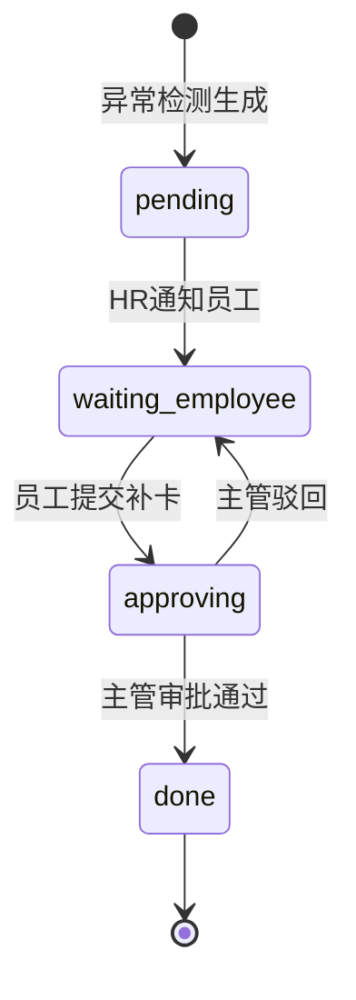
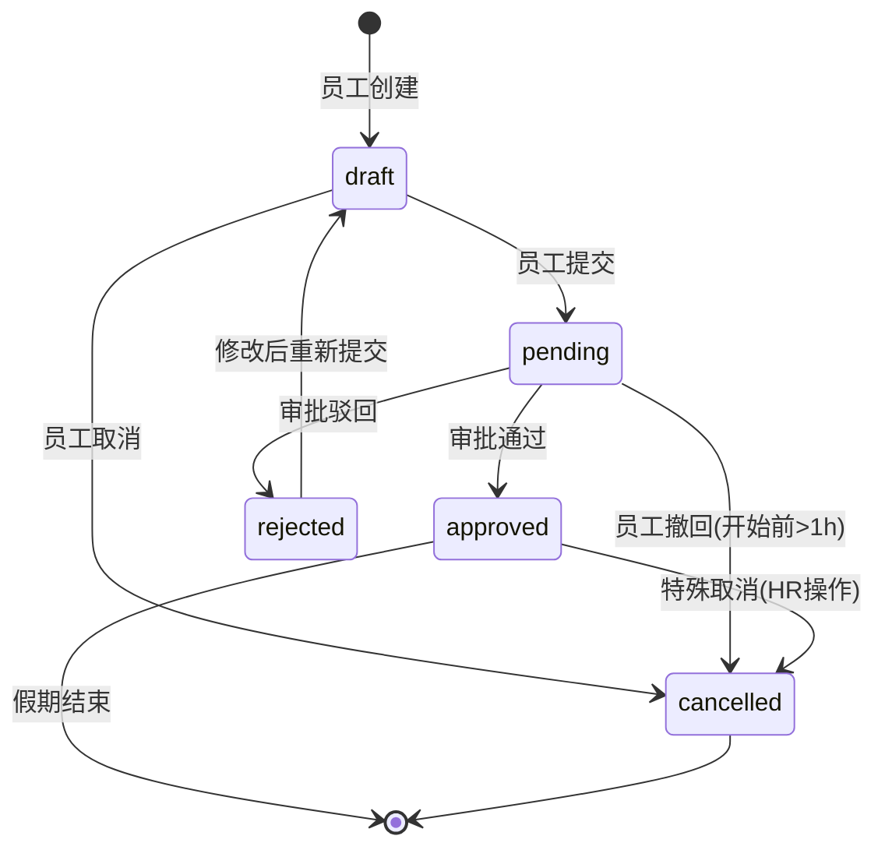
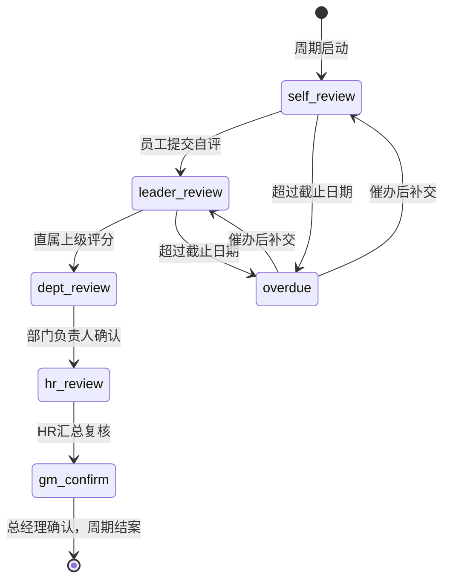
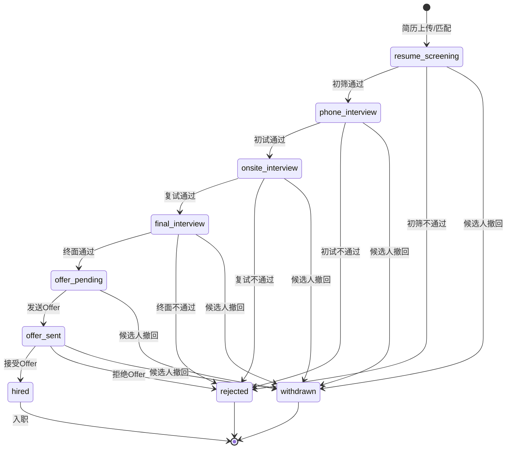

# 业务规则 (Business Rules)

> 版本 2.0 · 2026-04-22
>
> 规则格式：ID / 触发时机 / 规则描述 / 失败处理 / 实现要求

---

## 1. 员工管理 (Employee)

### BR-EMPLOYEE-001 员工工号全局唯一

| 项目 | 说明 |
|------|------|
| **触发时机** | 创建员工 / 钉钉同步导入 |
| **规则** | `employee_no` 全局唯一，包含已离职员工（`deleted_at IS NOT NULL`）。格式：`E` + 3-4 位数字（如 E001、E1234）。 |
| **失败处理** | 返回 `EMP_002 工号已存在`，拒绝创建。 |
| **实现要求** | 数据库 UNIQUE 约束 + 应用层预检。**必须事务**。 |

### BR-EMPLOYEE-002 身份证校验

| 项目 | 说明 |
|------|------|
| **触发时机** | 创建/更新员工身份证号 |
| **规则** | 18 位身份证号校验：前 6 位地区码有效 + 中间 8 位合法日期 + 最后 1 位校验码。校验码算法：各位加权因子 `[7,9,10,5,8,4,2,1,6,3,7,9,10,5,8,4,2]`，余数映射 `['1','0','X','9','8','7','6','5','4','3','2']`。 |
| **失败处理** | 返回 `EMP_003 身份证号格式无效`。 |
| **实现要求** | 前端预校验 + 后端二次校验。加密存储（AES-256-GCM），日志脱敏。**必须审计**。 |

伪代码：
```
function validateIdCard(id: string): boolean {
  if (id.length !== 18) return false
  const weights = [7,9,10,5,8,4,2,1,6,3,7,9,10,5,8,4,2]
  const checks = ['1','0','X','9','8','7','6','5','4','3','2']
  let sum = 0
  for (let i = 0; i < 17; i++) sum += parseInt(id[i]) * weights[i]
  return checks[sum % 11] === id[17].toUpperCase()
}
```

### BR-EMPLOYEE-003 手机号/邮箱格式校验

| 项目 | 说明 |
|------|------|
| **触发时机** | 创建/更新员工联系方式 |
| **规则** | 手机号：`/^1[3-9]\d{9}$/`（中国大陆 11 位）。邮箱：标准 RFC 5322 格式。 |
| **失败处理** | 返回 `EMP_004 手机号格式无效` 或 `EMP_005 邮箱格式无效`。 |
| **实现要求** | 前端实时校验 + 后端校验。 |

### BR-EMPLOYEE-004 直属上级约束

| 项目 | 说明 |
|------|------|
| **触发时机** | 设置/变更员工直属上级 |
| **规则** | 直属上级（`direct_manager_id`）必须满足：① 上级在同部门或当前部门的祖先部门中 ② 不能指向自己 ③ 不能形成环形引用（A→B→C→A）。 |
| **失败处理** | 返回 `EMP_006 直属上级设置无效`。 |
| **实现要求** | 后端递归校验部门树。**必须事务**。 |

伪代码：
```
function validateManager(employeeId, managerId, deptId):
  if employeeId == managerId: reject("不能指向自己")
  managerDept = getEmployee(managerId).department_id
  if managerDept != deptId AND managerDept NOT IN getAncestorDepts(deptId):
    reject("上级不在同部门或上级部门")
  if hasCircularReference(employeeId, managerId): reject("环形引用")
```

### BR-EMPLOYEE-005 试用期管理

| 项目 | 说明 |
|------|------|
| **触发时机** | 员工状态为 `probation` 时的定期检查 |
| **规则** | 试用期最长 6 个月（自 `hire_date` 起）。到期前 15 天系统提醒 HR 操作转正或离职。超期未处理每日告警。 |
| **失败处理** | 仅告警，不自动变更状态。 |
| **实现要求** | 定时任务每日扫描。 |

### BR-EMPLOYEE-006 离职处理

| 项目 | 说明 |
|------|------|
| **触发时机** | 员工状态变更为 `resigned` |
| **规则** | ① 账号立即禁用（`user_accounts.is_active = false`） ② 员工数据软删除（`deleted_at = now()`） ③ 数据保留 2 年后可清理 ④ 释放导师带教名额 ⑤ 未完成的审批流转至 HR。 |
| **失败处理** | 账号禁用必须同步成功，其他异步处理失败人工跟进。 |
| **实现要求** | **必须事务**（账号禁用+状态变更）。**必须审计**。 |

### BR-EMPLOYEE-007 合同到期预警

| 项目 | 说明 |
|------|------|
| **触发时机** | 每日定时扫描 + 查询时计算 |
| **规则** | `contract_end - today ≤ 30天` → `expiring_soon`；`contract_end < today` → `expired`；其余 → `normal`。 |
| **失败处理** | 无（计算字段） |
| **实现要求** | 查询时动态计算，不存储。定时任务每日推送即将到期列表给 HR。 |

### BR-EMPLOYEE-008 身份证到期预警

| 项目 | 说明 |
|------|------|
| **触发时机** | 同 BR-EMPLOYEE-007 |
| **规则** | 同合同到期，阈值 30 天。 |

### BR-EMPLOYEE-009 钉钉同步优先级

| 项目 | 说明 |
|------|------|
| **触发时机** | 钉钉数据同步完成后 |
| **规则** | 钉钉为主数据源。同步后字段差异记入 `employee_diffs`，HR 选择 `accept_dingtalk`（以钉钉为准）或 `keep_system`（保留本系统值）。未处理差异标记 `sync_status = diff`。 |
| **失败处理** | 同步失败标记 `sync_status = failed`，记录日志，允许手动重试。 |
| **实现要求** | **必须幂等**（重复同步不产生重复差异）。 |

### BR-EMPLOYEE-010 资料完整度

| 项目 | 说明 |
|------|------|
| **触发时机** | 员工信息变更时重新计算 |
| **规则** | 必填字段权重：姓名 5% + 性别 5% + 出生 5% + 手机 10% + 身份证 10% + 学历 5% + 合同 15% + 照片 5% + 紧急联系人 10% + 银行卡 10% + 学历证书 10% + 资质证书 10%。有值得分，无值 0。总分 = 各项之和。 |
| **失败处理** | 无 |
| **实现要求** | 后端计算并存储 `completeness` 字段。 |

---

## 2. 组织架构 (Department)

### BR-DEPT-001 部门层级限制

| 项目 | 说明 |
|------|------|
| **触发时机** | 创建/移动部门 |
| **规则** | 部门树最多 6 级。`level = parent.level + 1`，若 `level > 6` 拒绝操作。 |
| **失败处理** | 返回 `DEPT_002 部门层级超过6级`。 |
| **实现要求** | 应用层校验。 |

### BR-DEPT-002 部门删除前置检查

| 项目 | 说明 |
|------|------|
| **触发时机** | 删除部门 |
| **规则** | 部门下无在职员工（`status != 'resigned'`）且无子部门时才可删除。 |
| **失败处理** | 返回 `DEPT_003 部门下有在职员工或子部门`。 |
| **实现要求** | **必须事务**。 |

### BR-DEPT-003 部门树完整性

| 项目 | 说明 |
|------|------|
| **触发时机** | 调整部门 `parent_id` |
| **规则** | ① 不能将部门移为自身的子部门（环检测） ② 移动后 `level` 递归更新 ③ 员工的部门引用保持有效。 |
| **失败处理** | 返回 `DEPT_004 操作导致环形引用`。 |
| **实现要求** | 递归 CTE 查询检测环。**必须事务**。 |

---

## 3. 考勤 (Attendance)

### BR-ATTENDANCE-001 迟到判定

| 项目 | 说明 |
|------|------|
| **触发时机** | 每日考勤异常扫描（定时任务 00:30） |
| **规则** | `clock_in > shift.work_start + shift.late_threshold_minutes` → 迟到。默认容忍 15 分钟。 |
| **失败处理** | 生成 `attendance_exceptions` 记录，类型 `late`。 |
| **实现要求** | **必须幂等**（同一天同一人不重复生成）。 |

伪代码：
```
for each employee in today_attendance:
  shift = getShift(employee)
  if clock_in > shift.work_start + 15min:
    createException(employee, date, 'late') IF NOT EXISTS
```

### BR-ATTENDANCE-002 早退判定

| 项目 | 说明 |
|------|------|
| **触发时机** | 同 BR-ATTENDANCE-001 |
| **规则** | `clock_out < shift.work_end` 且 `clock_out IS NOT NULL` → 早退。 |
| **失败处理** | 生成异常记录，类型 `early_leave`。 |
| **实现要求** | **必须幂等**。 |

### BR-ATTENDANCE-003 缺勤判定

| 项目 | 说明 |
|------|------|
| **触发时机** | 同 BR-ATTENDANCE-001 |
| **规则** | 工作日无任何打卡记录（`clock_in IS NULL AND clock_out IS NULL`）且非法定假日、非请假日 → 缺勤。 |
| **失败处理** | 生成异常记录，类型 `absent`。 |
| **实现要求** | 需联查 `holidays` 表和请假记录。**必须幂等**。 |

### BR-ATTENDANCE-004 漏打卡补卡流程

| 项目 | 说明 |
|------|------|
| **触发时机** | 员工申请补卡 |
| **规则** | 状态流：`pending` → `waiting_employee`（员工提交补卡申请）→ `approving`（主管审批）→ `done`。补卡需填写原因和佐证（门禁记录等）。每月补卡上限 3 次。 |
| **失败处理** | 超限返回 `ATT_002 本月补卡次数已用完`。 |
| **实现要求** | **必须审计**。 |

状态流：


### BR-ATTENDANCE-005 加班报备

| 项目 | 说明 |
|------|------|
| **触发时机** | 加班记录核销 |
| **规则** | 加班必须预先报备（有 `overtime_records` 记录且 `status = pending`），未报备的加班检测为异常（`type = overtime`）。 |
| **失败处理** | 未报备加班不计入补贴。 |
| **实现要求** | 核销时校验报备记录。 |

### BR-ATTENDANCE-006 加班补贴计算

| 项目 | 说明 |
|------|------|
| **触发时机** | 加班记录审批通过 |
| **规则** | 按部门类型区分：|

| 部门类型 | 补贴方式 | 计算规则 |
|----------|----------|----------|
| 职能部门 (functional) | 餐补 或 调休 | 餐补固定金额 [建议值 20元/次，待确认]；调休 = 加班时长 × 1.0 |
| 生产一线 (production) | 现金补贴 | 工作日 = 基础时薪 × 1.5 × 加班时长；休息日 = 基础时薪 × 2.0 × 加班时长；法定假日 = 基础时薪 × 3.0 × 加班时长 |

| **实现要求** | 需联查 `holidays` 表判断日期类型。**必须审计**。 |

---

## 4. 请假 (Leave)

> 注：请假模块不在当前前端原型范围，以下规则为后端预埋设计。

### BR-LEAVE-001 余额校验

| 项目 | 说明 |
|------|------|
| **触发时机** | 提交请假申请 |
| **规则** | `请求天数 ≤ 当前余额`，否则拒绝。 |
| **失败处理** | 返回 `LEAVE_001 余额不足`。 |
| **实现要求** | **必须事务** + **悲观锁**（`SELECT ... FOR UPDATE`），防止并发扣减。 |

### BR-LEAVE-002 请假审批流

| 项目 | 说明 |
|------|------|
| **触发时机** | 请假申请全生命周期 |
| **规则** | 见状态图。 |



| **实现要求** | **必须审计**所有状态变更。 |

### BR-LEAVE-003 年假余额计算

| 项目 | 说明 |
|------|------|
| **触发时机** | 每年 1 月 1 日自动核发 + 查询时计算 |
| **规则** | 按连续工龄：|

| 工龄 | 年假天数 |
|------|----------|
| ≥ 1年 且 < 10年 | 5 天 |
| ≥ 10年 且 < 20年 | 10 天 |
| ≥ 20年 | 15 天 |

当年未休假期最多结转 **5 天**至下一年 **3 月 31 日**前使用，逾期作废。

伪代码：
```
function calcAnnualLeave(hireDate, asOfDate):
  years = (asOfDate - hireDate) / 365.25
  if years < 1: return 0
  if years < 10: return 5
  if years < 20: return 10
  return 15

function calcCarryOver(unusedDays, year):
  carryOver = min(unusedDays, 5)
  expiryDate = Date(year + 1, 3, 31)
  return { days: carryOver, expiresAt: expiryDate }
```

| **实现要求** | 定时任务每年 1 月 1 日核发。**必须事务**。 |

### BR-LEAVE-004 病假证明

| 项目 | 说明 |
|------|------|
| **触发时机** | 提交病假申请 |
| **规则** | 请病假 ≥ 3 天必须上传医院证明附件。 |
| **失败处理** | 返回 `LEAVE_004 请上传病假证明`。 |

### BR-LEAVE-005 产假/陪产假

| 项目 | 说明 |
|------|------|
| **触发时机** | 提交产假/陪产假申请 |
| **规则** | 产假 158 天（湖北省标准：98+60）。陪产假 15 天。需提供相关证明。 |
| **实现要求** | 假期类型配置化，便于政策调整。 |

### BR-LEAVE-006 请假天数计算

| 项目 | 说明 |
|------|------|
| **触发时机** | 创建请假申请时自动计算 |
| **规则** | 只计算工作日，排除法定假日和公休日。半天假按 0.5 天计算。 |

伪代码：
```
function calcLeaveDays(startDate, endDate, startHalf, endHalf):
  days = 0
  for d in dateRange(startDate, endDate):
    if isWorkday(d) AND NOT isHoliday(d):
      days += 1
  if startHalf: days -= 0.5
  if endHalf: days -= 0.5
  return days
```

### BR-LEAVE-007 审批人规则

| 项目 | 说明 |
|------|------|
| **触发时机** | 确定审批人 |
| **规则** | 默认审批人 = 直属上级。上级请假/离职时可设代理审批人。HR 可作为最终审批人。≥ 3 天的假期需部门负责人加签。 |

### BR-LEAVE-008 撤回限制

| 项目 | 说明 |
|------|------|
| **触发时机** | 员工撤回请假申请 |
| **规则** | 请假开始时间前 ≤ 1 小时不可撤回，返回 `LEAVE_008 请假即将开始，无法撤回`。已批准的假期只能由 HR 操作取消。 |

---

## 5. 排班 (Shift)

### BR-SHIFT-001 排班冲突检测

| 项目 | 说明 |
|------|------|
| **触发时机** | 创建/修改排班 |
| **规则** | 同一员工同一日期只能有一个有效班次。 |
| **失败处理** | 返回 `SHIFT_001 排班冲突`。 |
| **实现要求** | 数据库 UNIQUE 约束（employee_id + date）。 |

### BR-SHIFT-002 排班修改通知

| 项目 | 说明 |
|------|------|
| **触发时机** | 排班公示后修改 |
| **规则** | 排班发布 ≥ 3 天后修改需通知受影响员工。修改记录保留审计。 |
| **实现要求** | **必须审计**。 |

---

## 6. 绩效 (Performance)

### BR-OKR-001 OKR 周期

| 项目 | 说明 |
|------|------|
| **触发时机** | 创建考核周期 |
| **规则** | 支持季度/半年/年度三种类型。同类型周期时间范围不可重叠。 |
| **失败处理** | 返回 `PERF_001 周期时间重叠`。 |

### BR-OKR-002 OKR 结构约束

| 项目 | 说明 |
|------|------|
| **触发时机** | 创建/编辑 OKR |
| **规则** | 每个 Objective 必须包含 2-5 个 Key Results。KR 必须可量化（有数值目标）。 |
| **失败处理** | 返回 `OKR_002 KR数量不符合要求`。 |

### BR-OKR-003 OKR 评分标准

| 项目 | 说明 |
|------|------|
| **触发时机** | OKR 评分 |
| **规则** | Google OKR 风格评分 0.0-1.0。0.7 视为满分（stretched goal）。≥ 0.7 绿色，0.4-0.6 黄色，< 0.4 红色。 |

### BR-OKR-004 OKR Check-in 频率

| 项目 | 说明 |
|------|------|
| **触发时机** | 定时检查 |
| **规则** | 活跃 OKR 要求每两周至少一次 check-in 更新。超过 2 周未更新 → 推送提醒。超过 4 周未更新 → 标记为 stale。 |

### BR-KPI-001 KPI 权重约束

| 项目 | 说明 |
|------|------|
| **触发时机** | 提交绩效表单 |
| **规则** | 所有 KPI 项的 `weight` 之和必须等于 100%（允许 ±0.01 浮点误差）。 |
| **失败处理** | 返回 `PERF_010 KPI权重之和不等于100%`。 |

伪代码：
```
totalWeight = sum(kpi.weight for kpi in form.kpis)
if abs(totalWeight - 100) > 0.01: reject("权重之和必须等于100%")
```

### BR-PERFORMANCE-001 绩效评审流程（5 阶段）

| 项目 | 说明 |
|------|------|
| **触发时机** | 绩效周期全生命周期 |
| **规则** | 5 阶段顺序推进，每阶段有独立截止日期。 |



| **实现要求** | 超期自动催办（最多 3 轮，间隔 2 天）。**必须审计**。 |

### BR-PERFORMANCE-002 AI 异常检测

| 项目 | 说明 |
|------|------|
| **触发时机** | 上级提交评分后 |
| **规则** | 三种异常检测：|

| 异常类型 | 条件 | 严重度 |
|----------|------|--------|
| 评分偏差 | `|leader_score - ai_suggested| ≥ 10` | warning |
| 自评-上级差 | `self_score - leader_score ≥ 18` | warning |
| 数据不一致 | 评分与外部数据源（MES/ERP）数据矛盾 | error |

| **失败处理** | 标记 `status = ai_anomaly`，不阻塞流程，但 HR 必须复核。 |
| **实现要求** | AI 校验异步执行。 |

### BR-PERFORMANCE-003 绩效等级映射

| 分数区间 | 等级 | 绩效系数 |
|----------|------|----------|
| ≥ 90 | A | 1.20 |
| 85-89 | B+ | 1.05 |
| 80-84 | B | 1.00 |
| 70-79 | B- | 0.95 |
| 60-69 | C | 0.85 |
| < 60 | D | 0.70 |

### BR-PERFORMANCE-004 360 反馈

| 项目 | 说明 |
|------|------|
| **触发时机** | 绩效评审期间 |
| **规则** | 每位被评人至少需要 5 位评价人（上级 1 + 同级 2 + 下级 1 + 跨部门 1）。评价人由 HR 指定或员工提名后 HR 确认。 |
| **失败处理** | 评价人不足 5 位时提示 HR 补充。 |

### BR-PERFORMANCE-005 绩效申诉

| 项目 | 说明 |
|------|------|
| **触发时机** | 绩效结果公布后 7 天内 |
| **规则** | 员工可发起申诉，流程：员工提交 → HR 受理 → 复核（含 AI 重新评估）→ 维持/修改结果。申诉仅允许 1 次。 |
| **实现要求** | **必须审计**。 |

---

## 7. 招聘 (Recruitment)

### BR-JOB-001 JD 审批

| 项目 | 说明 |
|------|------|
| **触发时机** | JD 发布 |
| **规则** | 新建 JD 状态为 `profile_pending`，生成画像后可变更为 `recruiting`。HR 审核通过后发布。 |
| **实现要求** | **必须审计**。 |

### BR-JOB-002 关闭 JD 前置检查

| 项目 | 说明 |
|------|------|
| **触发时机** | JD 状态变更为 `completed` 或 `paused` |
| **规则** | 关闭前必须处理所有活跃候选人（进入 `hired`/`rejected`/`withdrawn` 终态）。 |
| **失败处理** | 返回 `RECRUIT_002 仍有未处理的候选人`。 |

### BR-CANDIDATE-001 候选人去重

| 项目 | 说明 |
|------|------|
| **触发时机** | 简历上传/候选人创建 |
| **规则** | 手机号 + 邮箱双重去重。同一手机号或邮箱视为同一候选人。 |
| **失败处理** | 关联到已有候选人，不创建新记录，提示 HR。 |

### BR-CANDIDATE-002 重复投递限制

| 项目 | 说明 |
|------|------|
| **触发时机** | 候选人匹配岗位 |
| **规则** | 同一候选人 2 年内不得重复投递同一岗位（`rejected` 后 2 年内不可重新匹配同一 `job_id`）。 |
| **失败处理** | 返回 `RECRUIT_003 候选人2年内已投递该岗位`。 |

### BR-INTERVIEW-001 面试官冲突检测

| 项目 | 说明 |
|------|------|
| **触发时机** | 安排面试 |
| **规则** | 面试官在同一时间段（`scheduled_at ± duration_minutes`）内不可有其他面试安排。 |
| **失败处理** | 返回 `INTERVIEW_001 面试官时间冲突`。 |

### BR-INTERVIEW-002 面试反馈时限

| 项目 | 说明 |
|------|------|
| **触发时机** | 面试完成后 |
| **规则** | 面试官必须在面试完成后 24 小时内提交反馈。超时系统提醒，超 48 小时升级通知 HR。 |

### BR-INTERVIEW-003 候选人状态流转



### BR-OFFER-001 Offer 审批

| 项目 | 说明 |
|------|------|
| **触发时机** | 发送 Offer |
| **规则** | Offer 发送前需 HRD（HR Director）审批。包含薪资、岗位、入职日期等关键信息。 |
| **实现要求** | **必须审计**。 |

### BR-OFFER-002 Offer 有效期

| 项目 | 说明 |
|------|------|
| **触发时机** | Offer 发送后定时检查 |
| **规则** | Offer 默认有效期 7 天。到期未响应自动标记为 `withdrawn`。到期前 2 天提醒候选人。 |
| **实现要求** | 定时任务检查。 |

### BR-OFFER-003 Offer 接受后触发

| 项目 | 说明 |
|------|------|
| **触发时机** | 候选人接受 Offer |
| **规则** | ① 候选人状态 → `hired` ② 自动创建入职流程待办 ③ 通知 HR 准备入职材料 ④ 候选人数据可关联为员工预记录。 |
| **实现要求** | **必须事务**（状态变更 + 入职流程创建）。 |

---

## 8. AI 数字员工

### BR-AI-001 身份过滤

| 项目 | 说明 |
|------|------|
| **触发时机** | 每次 AI 对话请求 |
| **规则** | AI 查询数据时必须注入当前用户 `user_id` 和 `roles` 作为过滤条件。employee 只能查自己，manager 只能查下属，hr/admin 可查全部。 |
| **实现要求** | 在 AI Agent 的 tool/function 层统一注入身份上下文，禁止在 prompt 中传递权限逻辑。 |

### BR-AI-002 隐私保护

| 项目 | 说明 |
|------|------|
| **触发时机** | AI 生成回答时 |
| **规则** | AI 不得在回答中包含：他人身份证号、银行卡号、具体薪资金额、他人绩效评分（除非当前用户有权限查看）。敏感字段在传入 AI 前脱敏。 |
| **实现要求** | AI Agent 的数据查询工具返回前执行脱敏过滤。**必须审计**（记录涉及敏感数据的查询）。 |

### BR-AI-003 Prompt Injection 防护

| 项目 | 说明 |
|------|------|
| **触发时机** | 用户发送消息时 |
| **规则** | ① System prompt 与用户输入严格分离 ② 用户输入放入 `<user_message>` 标签内 ③ System prompt 中声明忽略用户对角色的重新定义 ④ 输出检测敏感信息泄露。 |
| **实现要求** | 中间件层实现输入预处理和输出后处理。 |

### BR-AI-004 上下文窗口管理

| 项目 | 说明 |
|------|------|
| **触发时机** | 多轮对话 |
| **规则** | 单次对话上下文限制：GPT-4 128k tokens，Claude 200k tokens。历史消息超限时使用滑动窗口（保留最近 N 条 + 摘要）。 |

### BR-AI-005 对话归档

| 项目 | 说明 |
|------|------|
| **触发时机** | 定时任务每日 03:00 |
| **规则** | 创建时间 > 90 天的对话标记为已归档（`archived_at = now()`）。归档后消息不可修改，仅可只读查看。 |
| **实现要求** | **必须幂等**。 |

### BR-AI-006 Token 用量限制

| 项目 | 说明 |
|------|------|
| **触发时机** | 每次 AI 调用前 |
| **规则** | 每用户每日 Token 上限 50,000 [建议值，待确认]。超限返回 `AI_006 今日AI对话额度已用完，请明天再试`。HR/Admin 额度翻倍。 |
| **实现要求** | Redis 计数器，key = `ai:token:{userId}:{date}`，TTL 24h。 |

### BR-AI-007 数据来源标注

| 项目 | 说明 |
|------|------|
| **触发时机** | AI 回答涉及具体数据时 |
| **规则** | AI 回答中引用的数据必须标注来源（如"数据来自考勤系统 2026-04-22"），通过 `sources` 字段返回。 |

### BR-AI-008 简历筛选免责

| 项目 | 说明 |
|------|------|
| **触发时机** | AI 简历筛选结果返回时 |
| **规则** | 每个筛选结果必须附带免责声明：`"此结果仅供参考，最终决定必须由人类做出"`。结果不可作为唯一录用/拒绝依据。 |

### BR-AI-009 内容安全

| 项目 | 说明 |
|------|------|
| **触发时机** | AI 输入和输出 |
| **规则** | 输入：检测并拒绝违法违规内容请求。输出：过滤可能的歧视性、侮辱性、政治敏感内容。 |
| **实现要求** | 接入内容安全 API 或关键词过滤。 |

### BR-AI-010 流式响应超时

| 项目 | 说明 |
|------|------|
| **触发时机** | SSE 流式响应期间 |
| **规则** | 首字节超时 5s，整体超时 120s [建议值，待确认]。超时自动中断并返回错误事件 `event: error`。 |

### BR-AI-011 知识库来源标注

| 项目 | 说明 |
|------|------|
| **触发时机** | AI 基于知识库回答时 |
| **规则** | 必须标注引用的文档名称和页码（如有），通过 `sources` 字段返回。向量相似度低于 0.7 的检索结果不使用。 |

### BR-AI-012 会话隔离

| 项目 | 说明 |
|------|------|
| **触发时机** | 切换 AI Agent 场景 |
| **规则** | 不同 Agent（如 `hr_assistant` 和 `resume_screener`）的对话上下文完全隔离。切换场景必须新建会话。同一场景内的会话可继续。 |

---

## 附录：错误码汇总

| 错误码 | 模块 | 说明 |
|--------|------|------|
| AUTH_001 | Auth | 用户不存在 |
| AUTH_002 | Auth | 密码错误 |
| AUTH_003 | Auth | 账号已禁用 |
| AUTH_004 | Auth | Refresh Token 已过期 |
| AUTH_005 | Auth | 权限不足 |
| EMP_002 | Employee | 工号已存在 |
| EMP_003 | Employee | 身份证号格式无效 |
| EMP_004 | Employee | 手机号格式无效 |
| EMP_005 | Employee | 邮箱格式无效 |
| EMP_006 | Employee | 直属上级设置无效 |
| EMP_010 | Employee | 钉钉 API 连接失败 |
| EMP_011 | Employee | 同步正在进行中 |
| EMP_020 | Employee | 无差异可处理 |
| DEPT_002 | Department | 部门层级超过6级 |
| DEPT_003 | Department | 部门下有在职员工或子部门 |
| DEPT_004 | Department | 操作导致环形引用 |
| ATT_001 | Attendance | 异常已处理 |
| ATT_002 | Attendance | 本月补卡次数已用完 |
| LEAVE_001 | Leave | 余额不足 |
| LEAVE_004 | Leave | 请上传病假证明 |
| LEAVE_008 | Leave | 请假即将开始无法撤回 |
| SHIFT_001 | Shift | 排班冲突 |
| PERF_001 | Performance | 周期时间重叠 |
| PERF_010 | Performance | KPI权重之和不等于100% |
| PERF_011 | Performance | 非当前阶段不可提交 |
| OKR_002 | OKR | KR数量不符合要求 |
| RECRUIT_002 | Recruitment | 仍有未处理的候选人 |
| RECRUIT_003 | Recruitment | 候选人2年内已投递该岗位 |
| INTERVIEW_001 | Interview | 面试官时间冲突 |
| AI_006 | AI | 今日AI对话额度已用完 |
| COMMON_404 | Common | 资源不存在 |
| COMMON_422 | Common | 参数校验失败 |
